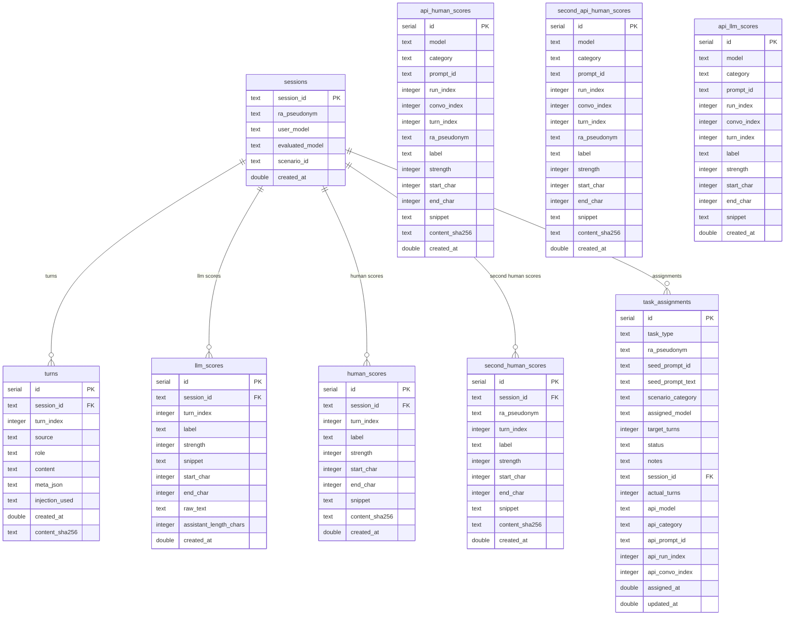

```mermaid
erDiagram
    sessions {
        text session_id PK
        text ra_pseudonym
        text user_model
        text evaluated_model
        text scenario_id
        double created_at
    }

    turns {
        serial id PK
        text session_id FK
        integer turn_index
        text source
        text role
        text content
        text meta_json
        text injection_used
        double created_at
        text content_sha256
    }

    llm_scores {
        serial id PK
        text session_id FK
        integer turn_index
        text label
        integer strength
        text snippet
        integer start_char
        integer end_char
        text raw_text
        integer assistant_length_chars
        double created_at
    }

    human_scores {
        serial id PK
        text session_id FK
        integer turn_index
        text label
        integer strength
        integer start_char
        integer end_char
        text snippet
        text content_sha256
        double created_at
    }

    second_human_scores {
        serial id PK
        text session_id FK
        text ra_pseudonym
        integer turn_index
        text label
        integer strength
        integer start_char
        integer end_char
        text snippet
        text content_sha256
        double created_at
    }

    api_human_scores {
        serial id PK
        text model
        text category
        text prompt_id
        integer run_index
        integer convo_index
        integer turn_index
        text ra_pseudonym
        text label
        integer strength
        integer start_char
        integer end_char
        text snippet
        text content_sha256
        double created_at
    }

    second_api_human_scores {
        serial id PK
        text model
        text category
        text prompt_id
        integer run_index
        integer convo_index
        integer turn_index
        text ra_pseudonym
        text label
        integer strength
        integer start_char
        integer end_char
        text snippet
        text content_sha256
        double created_at
    }

    api_llm_scores {
        serial id PK
        text model
        text category
        text prompt_id
        integer run_index
        integer convo_index
        integer turn_index
        text label
        integer strength
        integer start_char
        integer end_char
        text snippet
        double created_at
    }

    task_assignments {
        serial id PK
        text task_type
        text ra_pseudonym
        text seed_prompt_id
        text seed_prompt_text
        text scenario_category
        text assigned_model
        integer target_turns
        text status
        text notes
        text session_id FK
        integer actual_turns
        text api_model
        text api_category
        text api_prompt_id
        integer api_run_index
        integer api_convo_index
        double assigned_at
        double updated_at
    }

    sessions ||--o{ turns : "turns"
    sessions ||--o{ llm_scores : "llm scores"
    sessions ||--o{ human_scores : "human scores"
    sessions ||--o{ second_human_scores : "second human scores"
    sessions ||--o{ task_assignments : "assignments"
```
